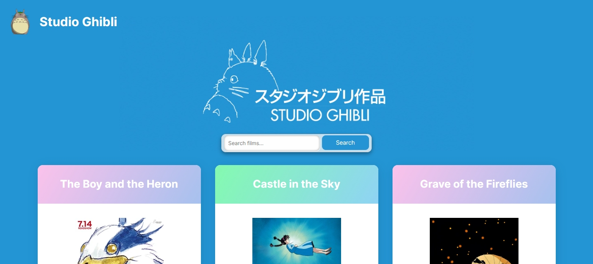

# 🐨 Studio Ghibli

**Studio Ghibli** is a practical demonstration of utilizing APIs in plain HTML, CSS, and JavaScript. This is a learning exercise.

## Screenshot

## CodeSandBox

The codes also available at codesandbox [here](https://codesandbox.io/p/sandbox/week2assignment-reza-rinaldi-5n5ddr).
